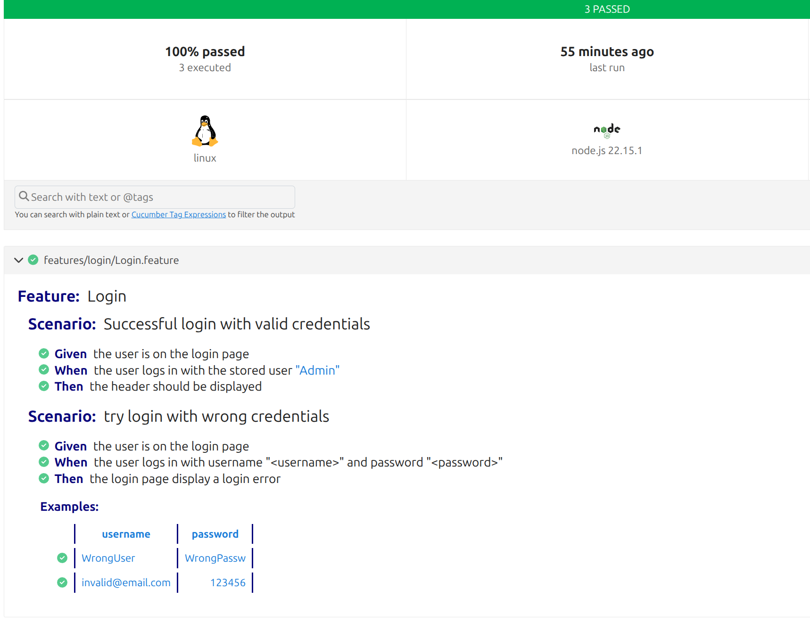
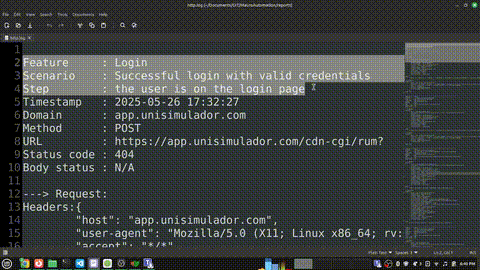
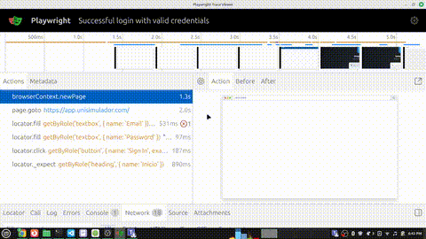

# 🤓 MauroAutomation

Automated testing framework that runs browser-based tests written in gherkin (pretty similar to natural language) and generates detailed reports.

## 🛠️ Technical Details

* **Framework**: [Cucumber.js](https://cucumber.io/) + [Playwright](https://playwright.dev/)
* **Language**: TypeScript
* **Design Pattern**: Page Object Model (POM)
* **Tracing**: Playwright tracing for debugging
* **Logging**: Custom HTTP logger for 4xx/5xx responses

## 🚀 Quick Start

```bash
git clone https://github.com/cuyedmundo/MauroAutomation.git
cd MauroAutomation
npm install                  # Install dependencies
npx playwright install       # Install required browser binaries
npx cucumber-js              # Run all feature files
```

### 🔐 Environment Variables

Create a `.env` file in the root directory with the following structure::

```txt
# Base URL of the OrangeHRM demo site
BASE_URL="https://app.unisimulador.com/"

# Credentials for test user "user"
user_EMAIL="EMAIL@EXAMPLE.COM"
user_PASSWORD="PASSWORD_FOR_THAT_USER"
```

```txt
You can define multiple users by changing the prefix. For example:

admin_EMAIL="admin@example.com"
admin_PASSWORD="admin123"

manager_EMAIL="manager@example.com"
manager_PASSWORD="secret"

Then, in your .feature file, use:
When the user logs in with the stored user "admin"

```

## 🗂️ Project Structure

```txt
├── cucumber.js              # Cucumber configuration (paths, reports)
├── features/                
│   ├── file.feature/        # Functionality written in Gherkin format
│   ├── file.steps.ts/       # Step definitions

├── src/
│   ├── pages/               # Page Object classes
│   ├── hooks/setup.ts       # Playwright setup and teardown, tracing
│   └── utils/httpLogger.ts  # Logs HTTP requests with error status codes
└── reports/                 
    ├── cucumber-report.html # Report with test summaries
    ├── junit.xml            # Report for CI integration
    ├── Scenario.zip         # Playwright trace for scenario debugging
    └── http.log             # Captured HTTP requests and their responses for 4xx/5xx 
```

## 📊 Viewing Reports

### HTML report

Report with scenarios and steps executed

```bash
open reports/cucumber-report.html
```



### HTTP logged errors

Report with details of HTTP 4xx/5xx codes loged during the test

```bash
open reports/http.log
```



### Visualize Playwright trace

Displays a rendered DOM, all network activity, and console messages that occurred during each steps of the test execution.

```bash
npx playwright show-trace reports/scenario_name.zip
```



## 🤝 Contributing

Feel free to open issues or submit pull requests. Contributions are welcome!

## 📝 License

This project is licensed under the GPL license.
